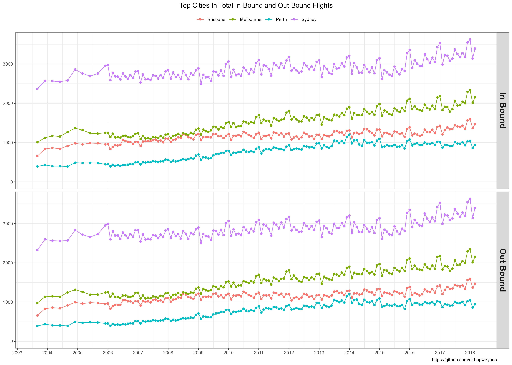
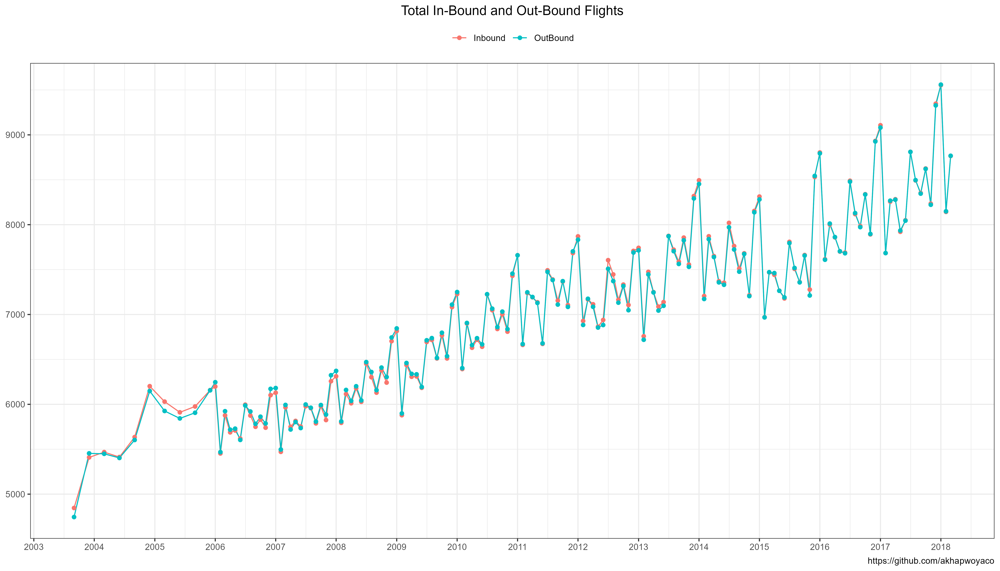
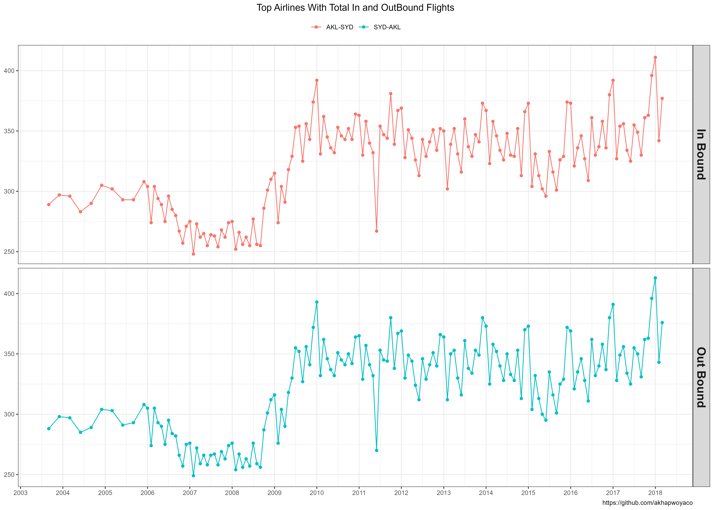

# Australian Flights

-   Analysis of International Flights operating from Australia provides an overview of the industry, pointing out trends over the course of time for which the data represents, 2003 to 2018. The findings are well suited to answers regarding questions such as:

   
