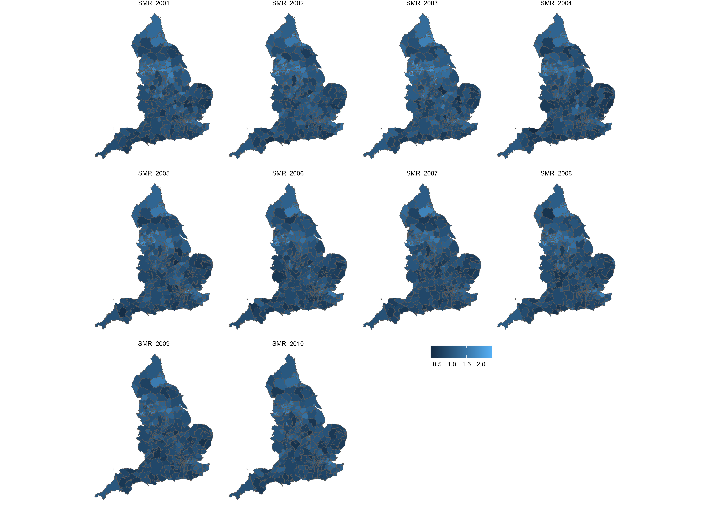

# Health Impact Analysis

-   An investigation of the hospital admission rates for Chronic obstructive pulmonary disease (COPD), a type of lung disease with long-term breathing problems, in England between 2001–2010, based on datasets:

-   Number of hospital admissions due to COPD for each year between 2001 and 2010 in 324 local authority administrative areas in England.

-   Expected number of cases (calculated using indirect standardization by applying the age–sex specific rates for the whole of England to the age–sex population profile of each of the local authorities.)

-   The observed counts

 

Datasets:

1.  The observed counts can be found in `copdobserved.csv` and the dataset has the following variables:

-   name - Name of local authority,
-   Y20XX - Observed number of hospital admissions for COPD in the year 20XX.

2.  The expected counts can be found in `copdexpected.csv` and the dataset has the following variables:

-   name - Name of local authority,
-   E20XX - Expected number of hospital admissions for COPD in the year 20XX.

3.  Shapefiles for England split by local authorities `(englandlocalauthority.shp, englandlocalauthority.dbf, englandlocalauthority.shx and englandlocalauthority.prj)`
