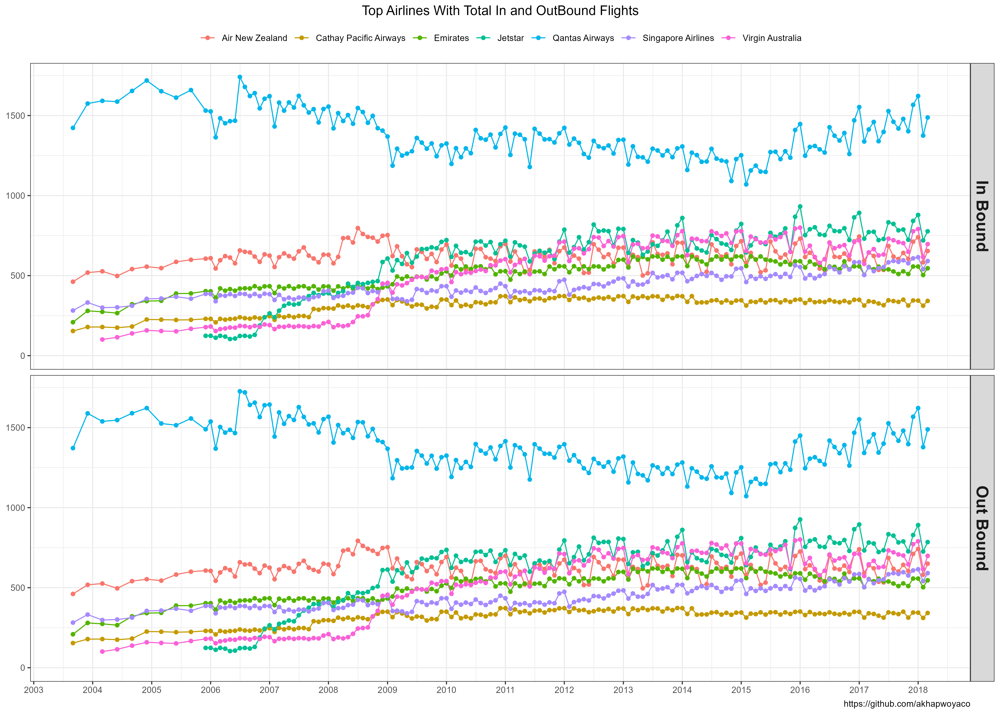
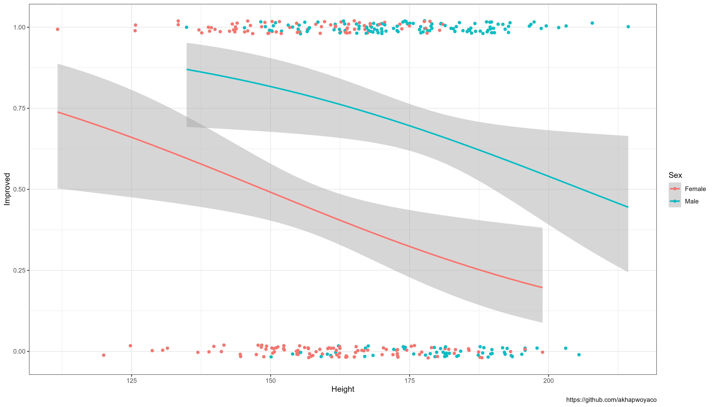
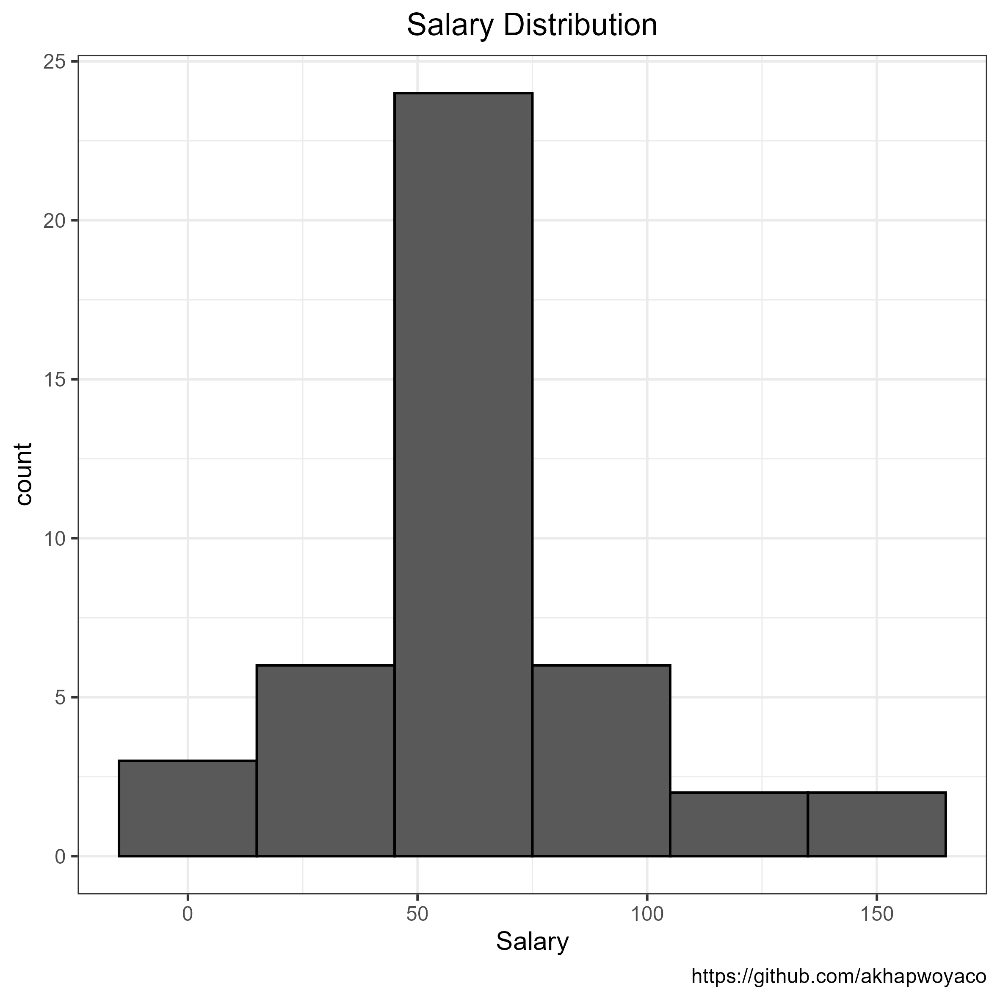
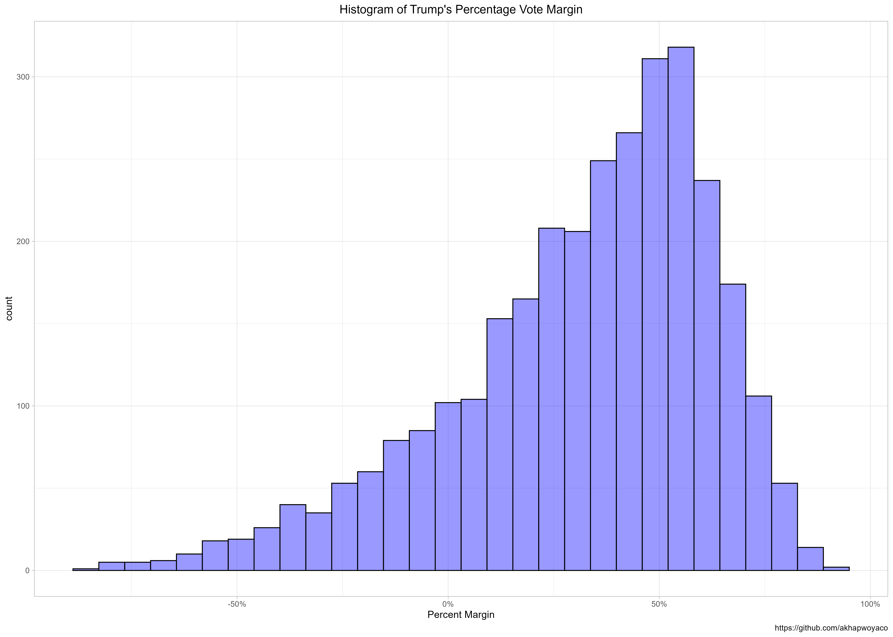
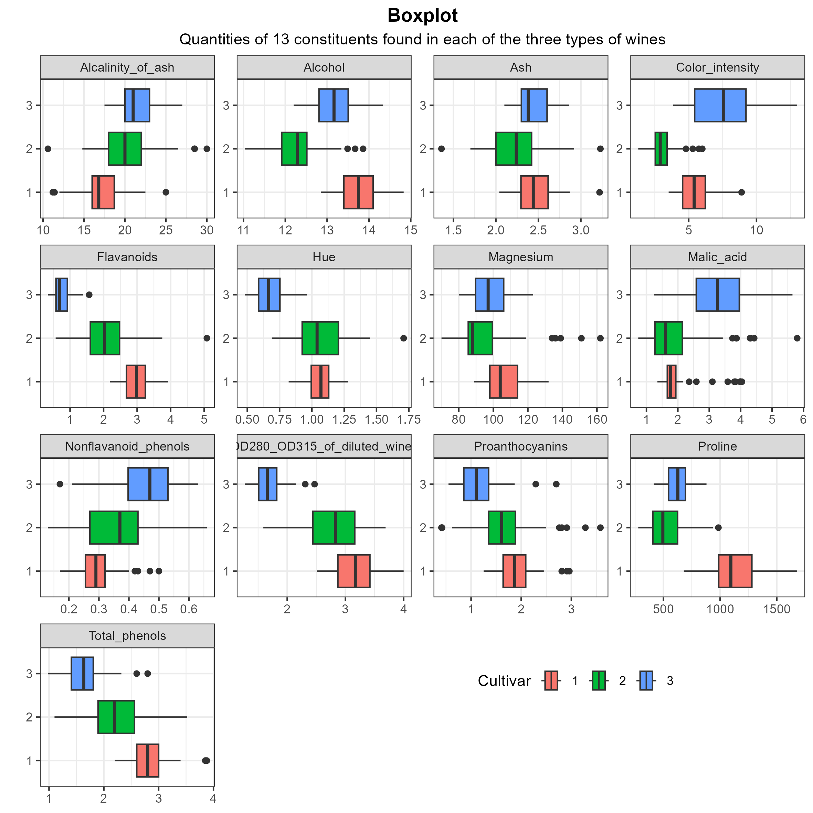
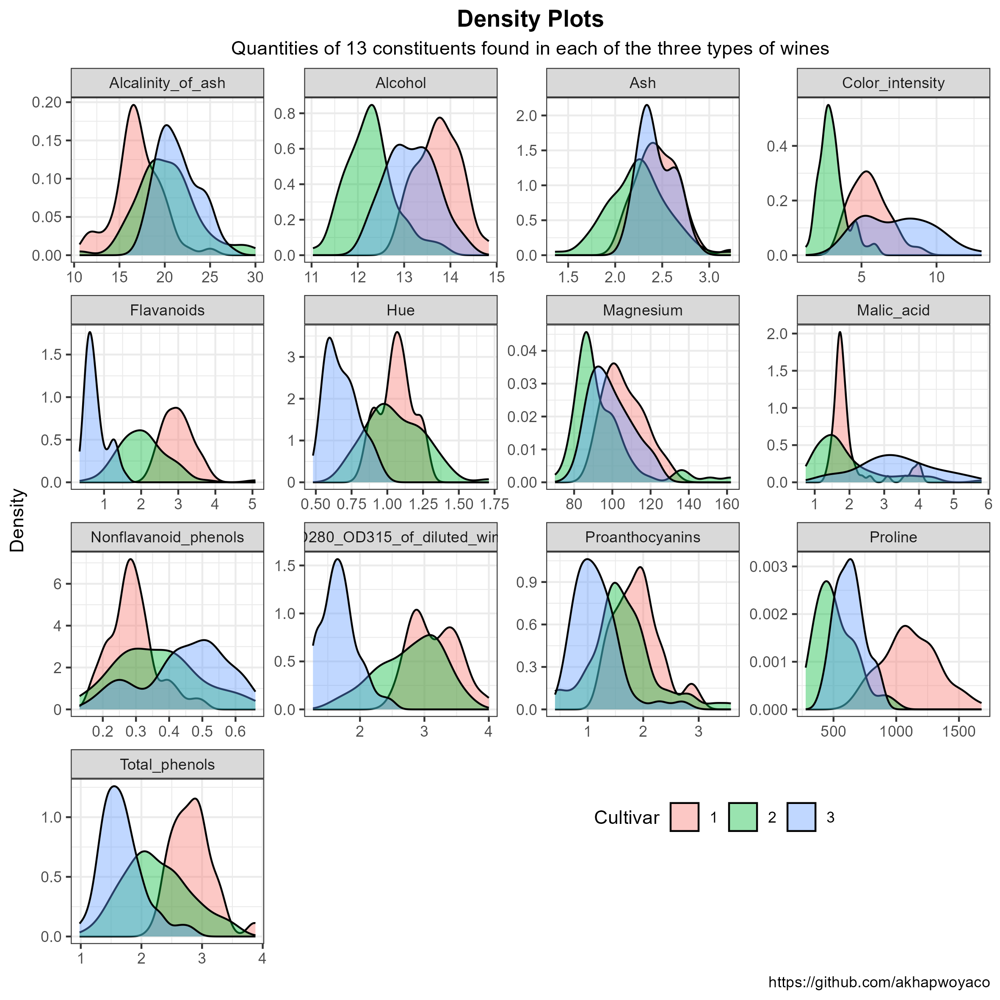
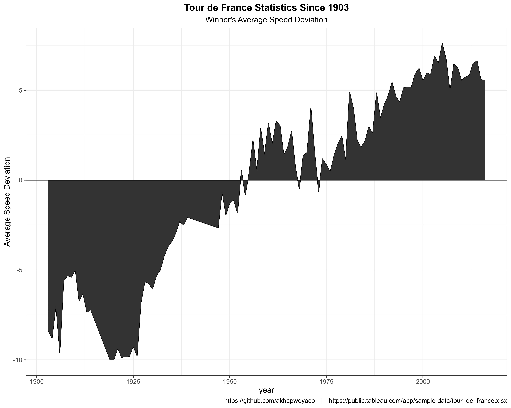

# Visualizations-

Visualizations of Various Datasets

## [Australian Flights](AustralianFlights/)

-   Analysis of International Flights operating from Australia provides an overview of the industry, pointing out trends over the course of time for which the data represents, 2003 to 2018. The findings are well suited to answers regarding questions such as:

## [Height vs Weight Analysis](logisticRegheightweight/)

## [Salary Distributions](sALARYhIST/)

## [Election 2016 Trump Margins](TrumpElection2016/)

-   Visualization of election 2016 Trump Votes Margin

## [Wines Data](WINES)

-   The data on wine constituents is obtained from the [UC Irvine Machine Learning Repository](https://archive.ics.uci.edu/dataset/109/wine), details the the quantitive level of 13 constituents in three types of wine.

 

## [Tour De France](./TourDeFrance)

- Tour de France Statistics Winner, distance, speed, location, and more about Tour de France since 1903.
- Data source: <https://public.tableau.com/app/learn/sample-data>

