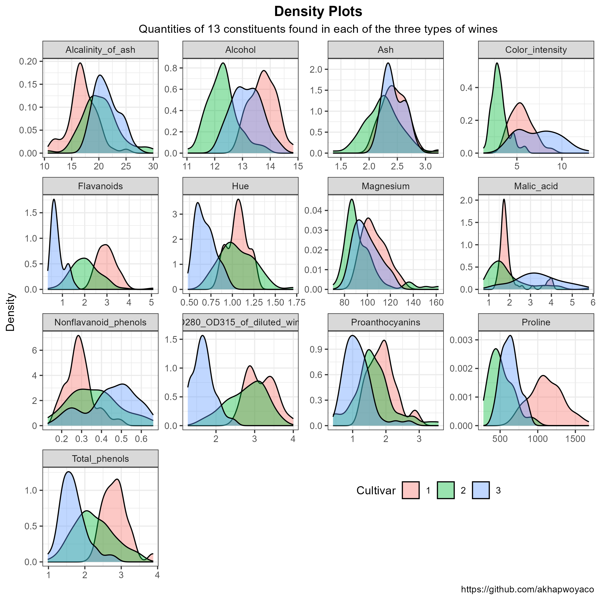

# Wines Data

-   The data on wine constituents is obtained from the [UC Irvine Machine Learning Repository](https://archive.ics.uci.edu/dataset/109/wine), details the the quantitive level of 13 constituents in three types of wine.

  
